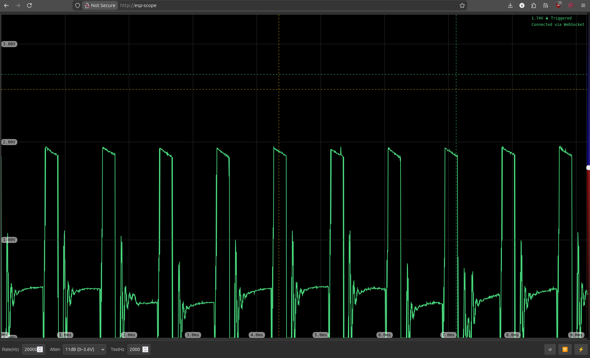

# ESP-Scope

## Overview
ESP-Scope is a web-based oscilloscope built using the ESP-IDF v5 framework. It allows users to visualize analog signals in real-time through a web browser. The project leverages the ESP32's ADC capabilities and serves a web interface for signal visualization. By default, one of the ESP pins generates a PWM signal, useful for debugging or generating configurable pulses.

It also contains a 3D design for a case for the Seeed XIAO ESP32C6.

> Parts of this project were written with AI assistance and are provided as-is, without guarantee.



## Features
- Real-time signal visualization on a web browser.
- Adjustable sample rate (1-83333 Hz) and attenuation.
- Crosshair functionality for precise measurements.
- Adjustable trigger level.
- Test PWM signal generation.
- Reset functionality to clear settings and reload the interface.
- Power off from the browser.

## Getting Started

### Quickstart — Flash without installing anything

Pre-built firmware binaries are available on the [Releases page](https://github.com/vtalpaert/esp-scope/releases/):
- `esp-scope-esp32-merged.bin` — generic ESP32
- `esp-scope-xiao-esp32c6-merged.bin` — Seeed XIAO ESP32C6

Connect your ESP32 via USB and flash directly from your browser — no drivers or toolchain needed:

👉 **[https://vtalpaert.github.io/esp-scope/](https://vtalpaert.github.io/esp-scope/)**

Works with Chrome, Edge, or Opera. Select your firmware version, click **Install**, and the correct binary is picked automatically for your chip.

---

### Prerequisites
- ESP32 development board.
- [ESP-IDF](https://github.com/espressif/esp-idf) installed and configured.
- USB cable to connect the ESP32 to your computer.
- A web browser (e.g., Chrome, Firefox).

### Downloading the Project
1. Clone the repository:
   ```bash
   git clone https://github.com/vtalpaert/esp-scope.git
   ```
2. Navigate to the project directory:
   ```bash
   cd esp-scope
   ```

### Building and Flashing

If you have the esp-idf VSCode extension, just click on the flame to build, flash & monitor. Use the config settings for "espScope" to specify GPIO pins for the LED & "AP-Mode" button, and if necessary a board-specific setup file (one is provided for the Seeed Studio XIAO ESP32C6 to enable the internal ceramic antenna).

1. Set up the ESP-IDF environment:
   ```bash
   . $IDF_PATH/export.sh
   ```
2. Configure the project:
   ```bash
   idf.py menuconfig
   ```
3. Build the project:
   ```bash
   idf.py build
   ```
4. Flash the firmware to the ESP32:
   ```bash
   idf.py -p [PORT] flash
   ```
   Replace `[PORT]` with the serial port of your ESP32 (e.g., `/dev/ttyUSB0` or `COM3`).
5. Monitor the serial output:
   ```bash
   idf.py monitor
   ```

### Building with Docker

If you don't have ESP-IDF installed locally, you can build the firmware using the provided `Dockerfile`.

1. Build the Docker image and firmware:
   ```bash
   docker build -t esp-scope-firmware .
   ```
   Optionally override board-specific config values:
   ```bash
   docker build \
     --build-arg TARGET=esp32c6 \
     --build-arg LED_BUILTIN=8 \
     --build-arg BSP_CONFIG_GPIO=0 \
     --build-arg BOARD_SPECIFIC_INIT="boards/xiao_esp32c6.h" \
     -t esp-scope-firmware .
   ```

2. Copy the merged firmware binary out of the image:
   ```bash
   cid=$(docker create esp-scope-firmware)
   docker cp "$cid:/workspace/build/merged-firmware.bin" esp-scope-esp32-merged.bin
   docker rm "$cid"
   ```

3. Flash from within Docker (Linux only, requires access to the host USB device):
   ```bash
   docker run --rm --device=/dev/ttyUSB0 esp-scope-firmware \
     bash -c "esptool.py -p /dev/ttyUSB0 -b 460800 write_flash 0x0 build/merged-firmware.bin"
   ```
   Replace `/dev/ttyUSB0` with your serial port. On macOS/Windows, flashing from inside Docker is not supported due to USB passthrough limitations — copy the binary out and flash with `esptool.py` directly.

4. Monitor serial output from within Docker:
   ```bash
   docker run --rm -it --device=/dev/ttyUSB0 esp-scope-firmware \
     bash -c "source /opt/esp/idf/export.sh > /dev/null 2>&1 && \
              idf.py monitor"
   ```

### Using the esp-scope

1. After flashing, ESP-Scope will start as a WiFi access point. Connect to it to access the UI.
2. If desired, click the "WiFi" button and set your SSID & WiFi password. The device will reboot and join your network. Pressing and holding the GPIO "AP-Mode" button will erase the WiFi credentials and return to Access Point mode.
3. Open a web browser and navigate to "http://esp-scope" (you may have/need a default domain extension).
4. Use the web interface to:
   - Adjust settings like sample rate, attenuation & the test signal frequency.
   - Visualize signals in real-time.
   - Reset the interface using the "Reset" button.
   - Re-configure the WiFi using the "WiFi" button.
   - Power off the device.

The LED indicates one of four conditions:

| LED behaviour       | State                                      |
|---------------------|--------------------------------------------|
| Continuously lit    | Connecting to WiFi / starting wireless AP  |
| 1s equal flash      | AP mode — connect to the "ESP-Scope" AP    |
| Slow, brief flashes | Connected to the WiFi SSID set in the UI   |
| Rapid, brief flashes| Sending data to an active client           |

### Attaching hardware

The displayed signal is sampled from ADC0. The test signal is output on D1. The default GPIOs for the LED and "AP-Mode" button are 15 and 9 respectively (hard-wired on a Seeed XIAO ESP32C6 to the yellow LED and "Boot" button).

## 3D design

The 3D design is a two part case with space for a AA-battery (Li-poly 3.7v, which can connect directly to a Seeed XIAO ESP device) clips and holes for the USB-C connector and "ground", "signal" and "test" connections using standard 2.54mm pitch, easily cut from jumpers and soldered directly to the Seeed XIAO. The 3D design was done using Fusion 360 and printed on a Bambu Labs A1 Mini in 30 minutes.

I recommend putting the "Signal" connection in the middle, and never connecting the outer-most pins (ground and test) to avoid shorting the test signal to ground and (probably) frying the esp32. The middle (signal) pin can be connected to either of its neighbours and you'll see either the ground or the test signal.


## License
This project is licensed under the MIT License. See the LICENSE file for details.

## Acknowledgments
- Built using the ESP-IDF framework by Espressif Systems.
- Forked from [MatAtBread/esp-scope](https://github.com/MatAtBread/esp-scope).
